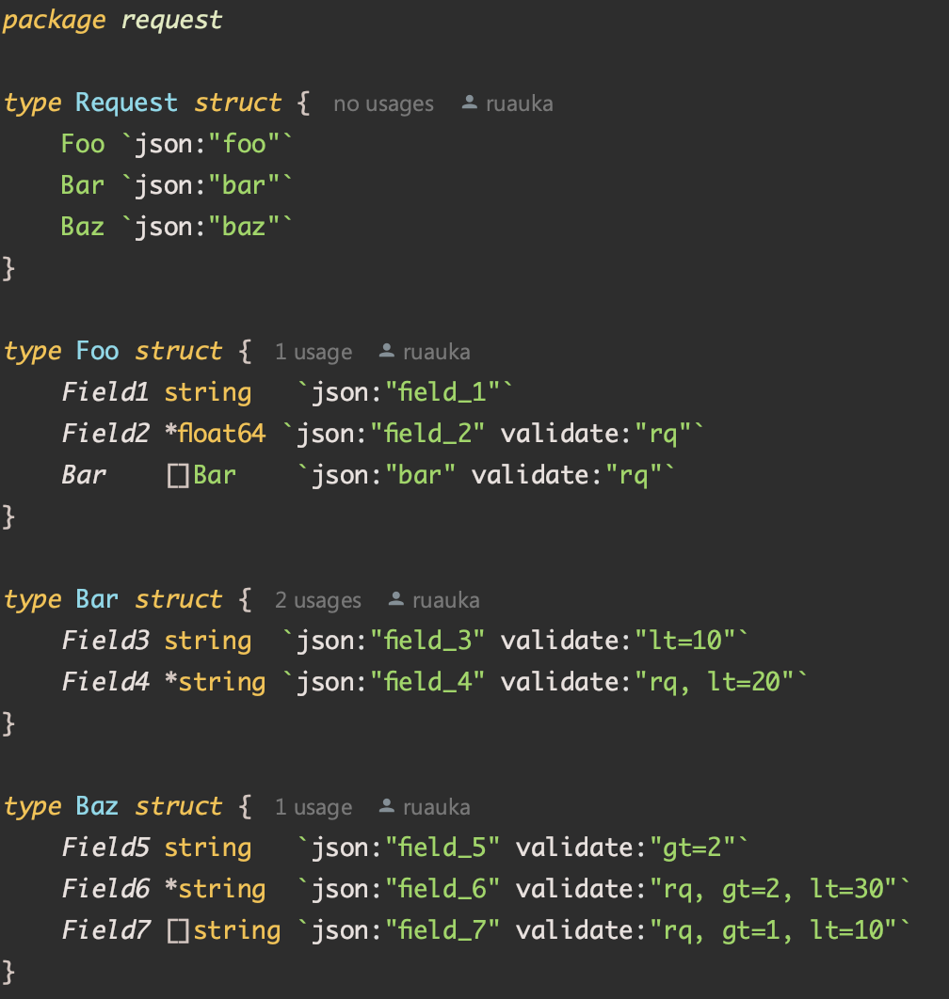
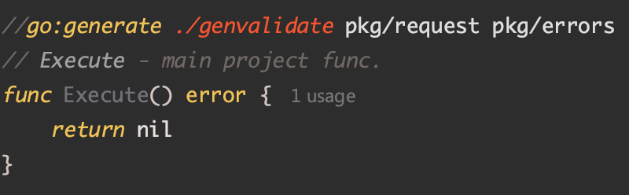

## GenValidator

## Overview

Validating code generator.

## Rules

- rq - Required field. All field types.
- lt - Length of the field must be less than the specified length. Only `string` and slices with string type.
- gt - Length of the field must be greater than the specified length. Only `string` and slices with string type.

## Usage

1. Add binary file `genvalidate` in project root.
2. Create file `request.go` with your `struct`.

<p align="left">
    
</p>

<p align="left">
    
</p>

3. Use tag `validate` and 3 rules.
4. Add string `//go:generate ./genvalidate pkg/request pkg/errors` above your Execute() func.

<p align="left">
    
</p>

- pkg/request - path where script creates `validate.go`, `validate_test.go`
- pkg/errors - path where script creates `errors.go`

5. Run plugin:

```bash
go generate ./...
```